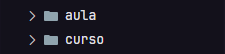
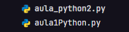
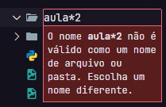
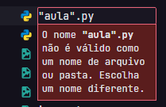
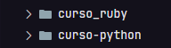
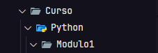

<h1>Nomeando Pastas e Arquivos</h1>

<h3>
    <li>Inicie SEMPRE com uma letra</li>
</h3>

<br><br>

<h3>
    <li>É permitido utilizar números, <b>exceto no início</b></li>
</h3>

<br><br>

<h3>
    <li>NUNCA utilize espaços ou caracteres especiais</li>
</h3>
<br>

> [!NOTE]
> <b>Caracteres especiais</b> <br>São símbolos e figuras usados em textos.<br><br>
> Exemplos de símbolos:<br>* / \ : ? " < > | • [ ] { }<br><br>
> Exemplos de figuras:<br>☁︎ ☾ ★ ✎ ➤

<br>
<b>Não faça ❌</b>
<br><br>


<br><br>

<br>
<p>
    <b>EXCEÇÃO:</b> Hífen "<b>-</b>" e Underline "<b>_</b>"
</p>
<p>Utiliza-se para separar palavras em nome de arquivos e pastas</p>


<b>Faça ✅</b>


<br><br><br>

<p>
    <b>EXCEÇÃO:</b> Barra "<b>/</b>" e Barra invertida "<b>\</b>"
</p>
<p>Utiliza-se, dentro do <a href="https://code.visualstudio.com">Visual Studio Code</a> (VSCode), para criar caminhos de um arquivo ou pasta.<br><br> Podemos entender que ao digitar uma barra após uma palavra, estamos criando uma pasta e indicando que colocaremos algo dentro dela. Observe alguns exemplos:
</p>
<br> 

<i>Pastas aninhadas (uma dentro da outra)</i>
```
Curso\Python\Modulo1
```

<br>

> Utilize a partir da opção "Nova Pasta" no VSCode

<i>Pasta que contém um arquivo python</i>
```
CursoPython/aula1.py
```

<br>

> Utilize a partir da opção "Novo Arquivo" no VSCode